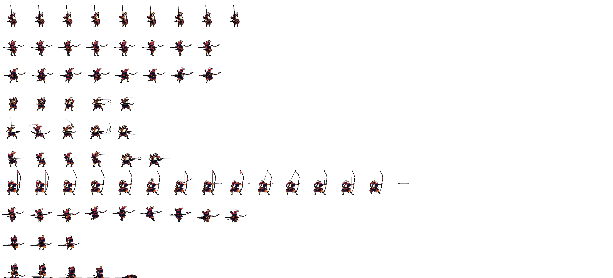

# react-native-sprite-sheet

An up to date sprite sheet library for React Native. Compatible with Expo.


## Why

Sprite Animations are animation clips that are created for 2D assets. There are various ways to create Sprite Animations. One way is to create them from a Sprite Sheet, a collection of Sprites arranged in a grid. The Sprites are then compiled into an Animation Clip that will play each Sprite in order to create the animation, much like a flipbook.

By using a sprite sheet, the number of image files that need to be loaded is greatly reduced, which can result in faster loading times. In addition to performance and memory benefits, using a sprite sheet can also make it easier to organize and manage the assets of a game. When a game has multiple image files, it can be difficult to keep track of which image files are used where in the game. By using a sprite sheet, all of the sprites for a particular game are stored in a single file, which makes it easier to manage and organize the assets of the game.

## Installation

```sh
npm install @darrench3140/react-native-sprite-sheet
```

## Usage

For detailed usage of the component, please check below links:

[Animated Sprite Usage](./documentation/AnimatedSprite.md)

[Sprite Usage](./documentation/Sprite.md)

## Quick Example

For detailed usage of the components, please check above section. For a quick usage of the AnimatedSprite Component, feel free to see below example.

### Example input spritesheet



#### Image Property:

Image size: `2816 x 1280`

Size of each frame: `128 x 128`

#### Animations:

- idle: `Frames 0 to 8`
- walk: `Frames 9 to 16`
- run: `Frames 17 to 24`
- attack1: `Frames 25 to 29`
- attack2: `Frames 30 to 34`
- attack3: `Frames 35 to 40`
- shot: `Frames 41 to 54`
- jump: `Frames 55 to 63`
- hurt: `Frames 64 to 66`
- dead: `Frames 67 to 71`

<hr>

### Component:

```ts
import { AnimatedSprite, getFrames, type AnimatedSpriteType } from '@darrench3140/react-native-sprite-sheet'

const Component = () => {
    const animatedRef = useRef<AnimatedSpriteType>(null)

    // ...

    return (
        <AnimatedSprite
            ref={animatedRef}
            source={require('../assets/spritesheet/samurai/Samurai_Archer_Spritelist.psd')}
            spriteSheetSize={{ width: 2816, height: 1280 }}
            size={{ width: 200, height: 200 }}
            offset={offset}
            columnRowMapping={[9, 8, 8, 5, 5, 6, 14, 9, 3, 5]}
            frameSize={{ width: 128, height: 128 }}
            defaultAnimationName="idle"
            animations={{
                idle: getFrames(0, 8),
                walk: getFrames(9, 16),
                run: getFrames(17, 24),
                attack1: getFrames(25, 29),
                attack2: getFrames(30, 34),
                attack3: getFrames(35, 40),
                shot: getFrames(41, 54),
                jump: [...getFrames(55, 63), 0],
                hurt: getFrames(64, 66),
                dead: getFrames(67, 71),
            }}
        />
    )
}
```

## Contributing

See the [contributing guide](CONTRIBUTING.md) to learn how to contribute to the repository and the development workflow.

## License

MIT

---

Made with [create-react-native-library](https://github.com/callstack/react-native-builder-bob)

## Acknowledgements 🙌

This project is inspired by the following projects and tools. Great thanks to the creators!

Credit:

- [@kaizer433/react-native-spritesheet](https://github.com/kaissaroj/react-native-spritesheet) Code and Component Inspiration
- [rn-sprite-sheet](https://github.com/mileung/rn-sprite-sheet) Code and Component Inspiration
- [Samurai](https://craftpix.net/freebies/free-samurai-pixel-art-sprite-sheets/) spritesheet from Animated example 1
- [Ninja](https://github.com/kaissaroj/react-native-spritesheet/blob/main/example/assets/spritesheet/ninja/spritesheet.png) spritesheet from Animated example 2
- [Elf Skill Icons](https://craftpix.net/freebies/free-rpg-night-elf-skill-icons/) icon set from Sprite example
- [Icon to Spritesheet converter](https://tools23.com/tools/sprites/pngs-to-sprite-sheet/) To convert fixed size icons to spritesheets