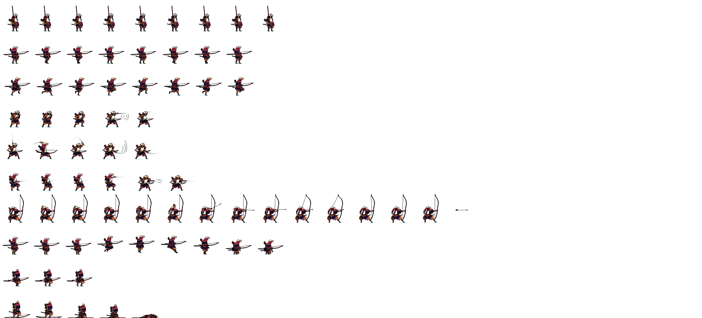

# Animated Sprite

Animated Sprite component can be used to animate different animations.

## Input spritesheet



### Image Property:

Image size: `2816 x 1280`

Size of each frame: `128 x 128`

### Animations:

- idle: `Frames 0 to 8`
- walk: `Frames 9 to 16`
- run: `Frames 17 to 24`
- attack1: `Frames 25 to 29`
- attack2: `Frames 30 to 34`
- attack3: `Frames 35 to 40`
- shot: `Frames 41 to 54`
- jump: `Frames 55 to 63`
- hurt: `Frames 64 to 66`
- dead: `Frames 67 to 71`

## Component:

```ts
import { AnimatedSprite, getFrames, type AnimatedSpriteType } from '@darrench3140/react-native-sprite-sheet'

const Component = () => {
    const animatedRef = useRef<AnimatedSpriteType>(null)

    // ...

    return (
        <AnimatedSprite
            ref={animatedRef}
            source={require('../assets/spritesheet/samurai/Samurai_Archer_Spritelist.psd')}
            spriteSheetSize={{ width: 2816, height: 1280 }}
            size={{ width: 200, height: 200 }}
            offset={offset}
            columnRowMapping={[9, 8, 8, 5, 5, 6, 14, 9, 3, 5]}
            frameSize={{ width: 128, height: 128 }}
            defaultAnimationName="idle"
            animations={{
                idle: getFrames(0, 8),
                walk: getFrames(9, 16),
                run: getFrames(17, 24),
                attack1: getFrames(25, 29),
                attack2: getFrames(30, 34),
                attack3: getFrames(35, 40),
                shot: getFrames(41, 54),
                jump: [...getFrames(55, 63), 0],
                hurt: getFrames(64, 66),
                dead: getFrames(67, 71),
            }}
            inLoop={loop}
            fps={fps}
            autoPlay={true}
        />
    )
}
```

## Props

| Name                 | Type                                                                                         | Required | Description                                                                                                                                    | Default value  |
| -------------------- | -------------------------------------------------------------------------------------------- | -------- | ---------------------------------------------------------------------------------------------------------------------------------------------- | -------------- |
| ref                  | React.RefObject\<AnimatedSpriteType\>                                                        | no       | Reference to the AnimatedSprite component instance for programmatic access                                                                     | null           |
| source               | ImageSourcePropType                                                                          | yes      | Path to the sprite sheet image file                                                                                                            | -              |
| spriteSheetSize      | { width: number, height: number }                                                            | yes      | the full width and height of the sprite sheet                                                                                                  | -              |
| size                 | { width: number, height: number }                                                            | yes      | the width and height of the displayed sprite                                                                                                   | -              |
| offset               | { x: number, y: number}                                                                      | no       | Offset position of the sprite within its container.                                                                                            | { x: 0, y: 1 } |
| columnRowMapping     | number[]                                                                                     | yes      | Array specifying the number of columns in each line                                                                                            | -              |
| frames               | { <br>"frame": { <br>"x": number,<br> "y": number,<br> "w": number,<br> "h": number<br> }}[] | no       | Array specifying the exact location (x, y axis, width and height) of each frame                                                                | -              |
| frameSize            | { width: number, height: number }                                                            | no       | the width and height of each frame in the sprite sheet. If not provided, the component auto calcuates the frame size based on columnRowMapping | -              |
| defaultAnimationName | String                                                                                       | yes      | Default animation to be played when the sprite is initialized                                                                                  | -              |
| animations           | { [name: String]: number[] }                                                                 | yes      | Object with keys as animation names and values as frame ranges in a number array                                                               | -              |
| fps                  | number                                                                                       | no       | Frames per second for the animation                                                                                                            | 60             |
| inLoop               | boolean                                                                                      | no       | should the animation loop?                                                                                                                     | false          |
| autoPlay             | boolean                                                                                      | no       | should the animation start playing automatically?                                                                                              | true           |

## Methods

`startAnimation(animationName?: string, loop?: boolean, customFps?: number)`: Starts the animation with the given name, loop and frame per second.

`stopAnimation()`: Stops the animation

`getCurrentAnimationName()`: Gets the current animation name


#### Example Usage

```js
// Run the animation 'run' with loop in fps of 30
ref.current?.startAnimation('run', true, 30)

// Rerun the animation with exact same settings as above
ref.current?.startAnimation()

// Get current animation name, returns 'run'
ref.current?.getCurrentAnimationName()

// Stop animation
ref.current?.stopAnimation()
```
